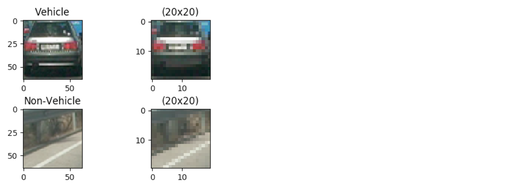
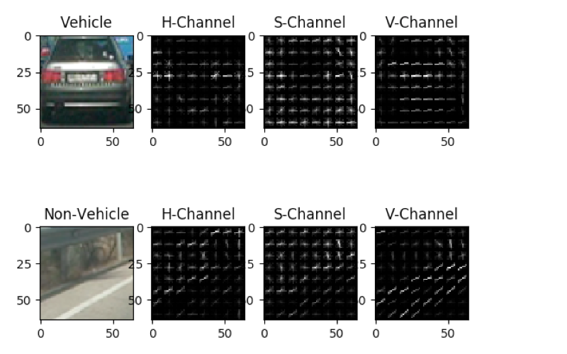

## **Vehicle Detection Project**

The software pipeline in main.py is written to detect vehicles in a video stream.

### **Table of  Contents**
- Color Space
- Training Phase
  - Features Extractions
  - Classifier Training
- Vehicle Detection Phase
  - Sliding window search
  - Features Extraction
  - Heatmaps and thresholding
  - Retraining on false positive data
- Final Video
- Problems/Issues &amp; Improvements

### **Color Maps**

The whole of this exercise was based on trial and error on the different color maps ( RGB , HSV , YCrCb , LUV ) .  I did not want to use RGB since they represent different colors under different lighting conditions. Instead I preferred to use a color space where the illumination is separated from the color information (e.g LUV, HSV etc). I picked up HSV since this color space consistently gave better classification results in my case.


```python
 cls.image=cv2.cvtColor(image,cv2.COLOR_RGB2HSV)
```

### **Features Extraction**

I used 3 features to do the training and classification

- **Spatial Binning**
  - A subsampled image retains the relevant features, and simple to compute, I decided to use this to add to the robustness of the classification. I have used a (20x20) subsampled image. Here the entire image is reshaped to a vector.
    ```python
    #extract_features.py 
    features = cv2.resize(img, 20).ravel())
    ```
- **Color Histograms**
  - I have used all the 3 channels of the HSV color space . 128 bins gave be the best accuracy during the training of the model.
    ```python
    #extract_features.py
    def extract_histogram_features(img):
        channel1_hist = np.histogram(img[:,:,0], bins=128, range=(0,256))
        channel2_hist = np.histogram(img[:,:,1], bins=128, range=(0,256))
        channel3_hist = np.histogram(img[:,:,2], bins=128, range=(0,256))
        features = np.concatenate((channel1_hist[0], channel2_hist[0], channel3_hist[0]))
        return features
    ```
- **HOG features**
  - HOG features is the main set of features. we can use just the HOG features to do the classification.
  -  Spatial binning and Color histograms cannot be used independently but can add to the robustness of the classification when used along with HOG features.
  - I have calculated the HOG features on all the 3 channels. After testing on a wide range of values for the orientations , pixels per cell & cells per block, I settled for 12 orientations , 8 pixels per cell and 1 cell per block. These gave me the good accuracy.
  - I observed that increasing the pixels per cell results in lower testing accuracy since a lot of information is lost as the pixels per cell increase.
    ```python
    #extract_features.py
    def extract_hog_features(img):
        f0 = hog(img[:,:,0], orientations=12, pixels_per_cell=(8,8),cells_per_block=(1,1),visualise=False, feature_vector=False,block_norm="L2-Hys")
        f1 = hog(img[:,:,1], orientations=12, pixels_per_cell=(8,8),cells_per_block=(1,1),visualise=False, feature_vector=False,block_norm="L2-Hys")
        f2 = hog(img[:,:,2], orientations=12, pixels_per_cell=(8,8),cells_per_block=(1,1),visualise=False, feature_vector=False,block_norm="L2-Hys")
        return [f0,f1,f2]
    ```
**Spatial Binning**


**Histogram of colors**


**HOG Features**



### **Classifier Training**

**Linear SVC** ( support vector classifier ) has been used as a classifier. The vehicle and non- vehicle images where first converted to the HSV color space and then the spatial binning, color histogram and the hog features were extracted for the image. There features were then scaled using the **StandardScaler**. The scaled feature set split into training and testing datasets and then was trained on the training dataset and tested against the testing dataset. The model generated was picked to a file for later use.

```python
# model.py
def fit(self,features,labels):
    self.features_scaler.fit(features)
    s_features = self.features_scaler.transform(features)
    rand_state = 50 
    X_train, X_test, y_train, y_test = train_test_split(s_features, labels, test_size=0.10, random_state=rand_state)
    t1=time.time()
    self.svc.fit(X_train, y_train)
    t2=time.time()
    self.testing_accuracy = self.svc.score(X_test, y_test)
    self.training_time = round(t2-t1, 2)
```


### **Sliding Window Search**

In this approach we slide a window across the image and try to identify the areas that are classified as a vehicle by the trained classifier. Instead of searching the whole image we search only in the region of interest i.e on the road. Also we need to take into account the the vehicles closer would be bigger in size and farther would be smaller in size. So we slide along the x-axis of a perspective view. I define a perspective view as a region as a given distance from the viewer. The perspective view would be larger closer to the viewer and gets smaller as it moves farther away. In the below image the green rectangles denote the perspective view.


**Perspective Views**


```python
#car_detector.py
def get_perspective_views(cls):
    #returns the perspective views coordinates
```
Calculation of the features is done by first resizing the perspective view to a height of 64 pixels and the sliding a window of 64x64 pixels across it. HOG features are calculated only once per perspective view and this is subsampled to obtain the HOG features of each window in the view.The windows that the classifier predicts as a vehicle, we will call them as hot windows. The yellow rectangles represent the hot windows in the below image.


**Hot Windows**

```python
#car_detector.py

def find_hot_windows(cls):
    #Iterates over the perspective views
    #for each perspective view calls sliding window to find all hot windows

def sliding_window(cls,pview):
    # Slides the window across the perspective view 
    # marks the windows predicted by classifier as vehicle as hot
```

### **Heatmaps and Thresolding**

Once we identify the hot windows using the sliding window approach, we will see that the multiple windows would have classified the same vehicle. We will need a way to group these. Also we will notice that we have some false positives. i.e the classifier identified certain non vehicles as vehicles.

So we will use heatmap technique to group the hot windows and thresholding to eliminate false positives.

Each pixel in the heatmap holds the number of windows with identified cars which contain that pixel. The higher the value of the pixel in the heatmap the more likely it is the part of the car. The heatmap is thresholded with a value of 10.  i.e all pixels less than 10 are zerod out. This will eliminate all the false positives.

After this the scypi label() method is used to label the connected pixels. The bounding box coordinates for each hot area are calculated and a rectangle is drawn.
**Heatmap**

```python
#car_detector.py
def create_heatmap(cls):
    #iterates over the detected hot windows
    #creates a heatmap
    #Also uses the heatmaps of the past 10 frames to average the heatmaps

def draw_cars(cls):
    #Uses the heatmap of the current frame.
    #Scipy's label() method is used
    labels = label(cls.current_heatmap)
    for car_number in range(1, labels[1]+1 ):
        #finds coordinates of the rectangle
        #draws rectangle
```

To further eliminated the false positives, I used a heatmap history to make sure that that the identified rectangle needs to be present in the last 3 frames.


### **Retraining on the false positives**

I did observe that there are still certain false positives. I tried to retain the model using the false positives as non-vehicles. This eliminated most of the false positives.

### **Final Video**

[](https://youtu.be/zI6V8Kzvbl0)

[https://youtu.be/zI6V8Kzvbl0](https://youtu.be/zI6V8Kzvbl0)

### **Discussion : Problems/Issues &amp; Improvements**

- This works good for the given project video but it needs to be tested on videos of different lighting conditions to see how the code performs.
- This is not identifying vehicles but just helping with a heatmap of a possible vehicle. The problem is when we have 2 cars overlapping each other, it identifies as one car. Also it does not give us a way to assign an number to each car as the label() might  assign a different label to the car&#39;s heatmap in different frames.
- At one specific frame when there was a considerable change in the road color then I saw that the classifier did a very bad job identifying many false positives. I suspect this will be case when we come across shadows of buildings on the roads.
- This procedure is very slow and cannot be used on a realtime scenario. We can definitely use certain concepts but its will need to a whole different architecture using Hardware FPGA&#39;s for HOG/Histogram calculations and GPU&#39;s for other generic code paths.
